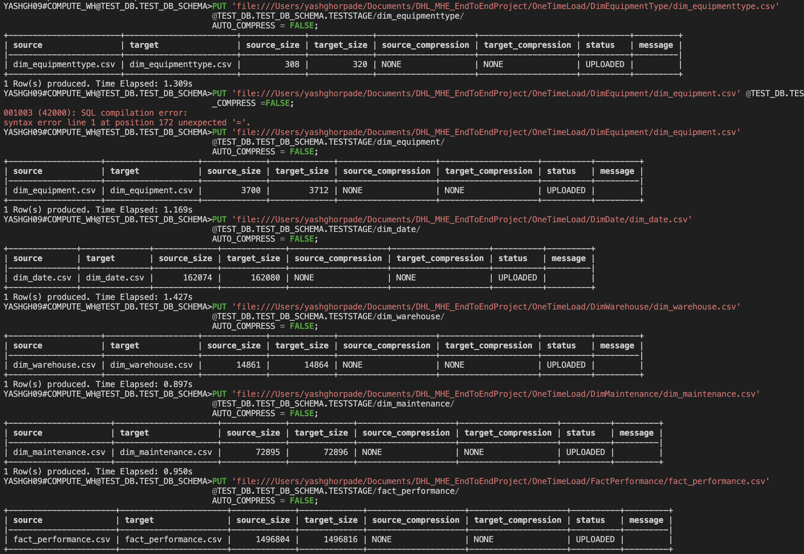
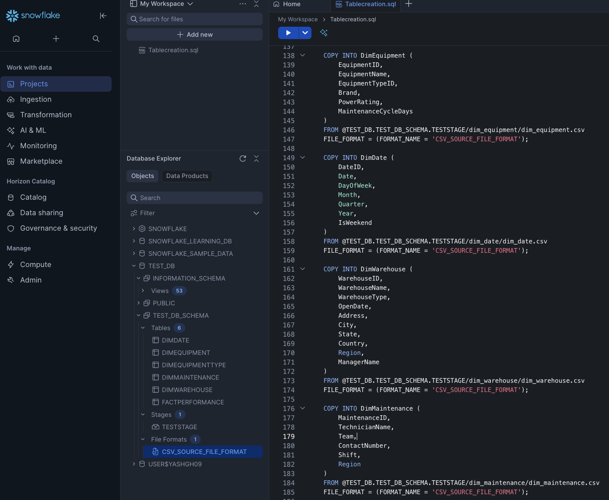
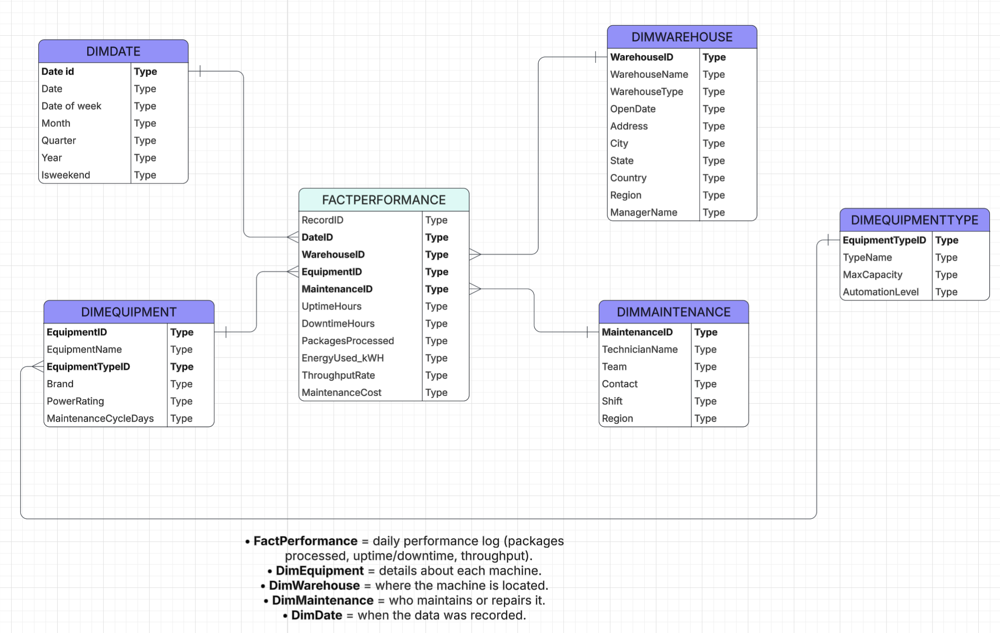

# 🏭 DHL MHE Performance Dashboard  

### 📊 End-to-End Data Analytics Project | Snowflake | Power BI | Python  

---

## 🚀 Project Overview  

This project simulates **DHL’s Material Handling Equipment (MHE) performance analysis**, where the goal is to monitor and optimize warehouse operations across multiple locations.  

It covers the **entire data pipeline** — from **data generation using Python**, to **data loading and transformation in Snowflake**, and finally **interactive reporting in Power BI**.  

The dashboard helps answer key operational questions like:  
- Which warehouses are performing best?  
- How does equipment uptime/downtime vary by location?  
- What’s the energy usage and maintenance cost trend over time?  

---

## 🧱 Tech Stack  

| Layer | Tools / Technologies Used |
|-------|---------------------------|
| **Data Generation** | Python, Faker Library |
| **Data Storage** | Snowflake Cloud Data Warehouse |
| **Data Loading** | SnowSQL CLI (PUT & COPY INTO commands) |
| **Visualization** | Power BI Desktop |
| **Documentation & Versioning** | GitHub |

---

## 🔄 Data Pipeline Flow  
##### Python CSV Generators → Snowflake Stages → Snowflake Tables → Power BI Dashboard


### 1️⃣ **Data Generation**
Synthetic data was generated using Python scripts for dimension and fact tables, such as:
- DimWarehouse
- DimEquipmentType
- DimEquipment
- DimMaintenance
- DimDate
- FactPerformance  

Example:  
```python
team_name = random.choice([
    'North Zone Tech Team',
    'Central Maintenance Crew',
    'South Facility Repairs',
    'East Zone Technicians',
    'Warehouse Automation Team'
])
```
### 2️⃣ **Data Loading into Snowflake**
All generated CSV files were first uploaded into Snowflake stages using the PUT command, then loaded into respective tables using COPY INTO.

Example SnowSQL commands:
```python

-- Step 1: Upload CSV to Stage
PUT 'file:///Users/yashghorpade/Documents/DHL_MHE_EndToEndProject/OneTimeLoad/DimWarehouse/dim_warehouse.csv'
@TEST_DB.TEST_DB_SCHEMA.TESTSTAGE/dim_warehouse/
AUTO_COMPRESS = FALSE;


-- Step 2: Load from Stage to Table
COPY INTO DimWarehouse (
    WarehouseID,
    WarehouseName,
    WarehouseType,
    OpenDate,
    Address,
    City,
    State,
    Country,
    Region,
    ManagerName
)
FROM @TEST_DB.TEST_DB_SCHEMA.TESTSTAGE/dim_warehouse/dim_warehouse.csv
FILE_FORMAT = (FORMAT_NAME = 'CSV_SOURCE_FILE_FORMAT');

```
<p align="center">
    
    
</p>

---

## 🗂️ Database Schema (ERD)

The database follows a Star Schema model with one fact table and multiple dimensions.

**FactPerformance** — Central fact table storing operational metrics (uptime, downtime, throughput, cost)

**DimWarehouse** — Warehouse details and location hierarchy

**DimEquipmentType** — Equipment categories and capacities

**DimEquipment** — Equipment-level details linked to type

**DimMaintenance** — Maintenance teams, shifts, and technicians

**DimDate** — Time dimension for temporal analysis

<p align="left">
    
</p>

---

## 📈 Power BI Dashboard Overview

Dashboard Link: 🔗 View Power BI Dashboard (https://shorturl.at/4m3V2)

The Power BI report consists of **four interactive pages**, with navigation buttons and bookmarks for smooth transitions.

<p align="center">
    
    
</p>

<p align="center">
    
    
</p>
